---
output:
  xaringan::moon_reader:
    yolo: false
    lib_dir: libs
    css: xaringan-themer.css
    seal: false
    nature:
      #autoplay: 30000
      #countdown: 60000
      highlightStyle: github
      highlightLines: true
      highlightSpans: true
      countIncrementalSlides: false
      #ratio: 16:9
      slideNumberFormat: "%current%"
editor_options: 
  chunk_output_type: console
---

```{r setup, include=FALSE}
options(htmltools.dir.version = FALSE)

knitr::opts_chunk$set(echo = TRUE, 
                      tidy = 'styler', 
                      comment = NA,
                      message = FALSE,
                      warning = FALSE)
```


```{r xaringan-themer, include=FALSE, warning=FALSE}
library(xaringanthemer)
style_duo_accent(
  primary_color = "#1381B0",
  secondary_color = "#FF961C",
  inverse_header_color = "#FFFFFF"
)

# Loaded packages

install.load::install_load(c("knitr", "xaringanExtra", "xaringan", "tidyverse", "kableExtra", "countdown"))

xaringanExtra::use_xaringan_extra(include = c("tile_view", "editable", "share_again", "broadcast", "animate_css", "panelset", "tachyons", "fit_screen", "clipboard", "search", "scribble", "freezeframe"))

use_webcam(width = 150, height = 150)

use_extra_styles()

```

background-image: url(images/gbg.jpg), url(images/R_logo.png)
background-position: 0% 100%, 100% 0%
background-size: 40%, 10%

class: title-page, center, middle

## Data analysis and visualization

```{r, echo=FALSE}
use_logo(
  image_url = "images/gbg.jpg",
  link_url = "https://bit.ly/gbganalyst",
  position = xaringanExtra::css_position(top = "1em", right = "1em"),
  exclude_class = c("title-page", "inverse", "hide_logo")
)
```

---
class: about-me-slide, inverse, middle, center

## About the trainer


### Ezekiel Adebayo Ogundepo

#### Data Scientist, Statistician

.fade[Virus Outbreak Data Network (VODAN Africa & Asia)<br> Nigeria Chapter]


[`r icons::fontawesome("link")` https://bit.ly/gbganalyst](https://bit.ly/gbganalyst)
[`r icons::fontawesome("twitter")` @gbganalyst](https://twitter.com/gbganalyst)
[`r icons::icon_style(icons::fontawesome("github"), scale = 1)` @gbganalyst](https://github.com/gbganalyst)

---
class: middle

.w-100.lh-copy[

Goal:

> The goal of this R workshop is to help you learn the most important skills in R for data science.

]

---
class: inverse, middle
name: toc

# Table of content

.w-100.lh-copy[

- [Introduction to pipe operator (`%>%`)](#cal)

- [Introduction to dplyr](#dplyr)

- [Data visualization with ggplot2](#viz)

]

---
class: middle, center, inverse
name: dplyr

# dplyr verbs


```{r, echo=FALSE}
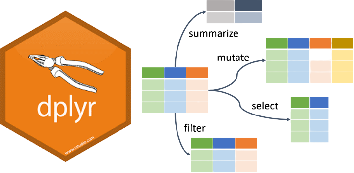
```

---
class: middle

## Introduction to dplyr package

.w-100.lh-copy[
dplyr is a grammar of data manipulation, providing a consistent set of verbs that help you solve the most common data manipulation challenges.


### Installation

The easiest way to get dplyr is to install the whole tidyverse:

```{r, eval=FALSE}
install.packages("tidyverse")
```
]


---
class: middle

# dplyr verbs

.w-100.lh-copy[

- `select()`: picks variables based on their names or column positions.

- `mutate()`: adds new variables that are functions of existing variables

- `filter()`: picks cases based on their values

- `group_by()`: group by one or more variables

- `summarise()`: reduces multiple values down to a single summary.

- `count()`: lets you quickly count the unique values of one or more variables

- `arrange()`:  changes the ordering of the rows.
]

---
class: middle

.w-100.lh-copy[
All of the dplyr functions (i.e. verbs) share a similar syntax. You can use them like this:
]

--

```{r, echo=FALSE, out.height="90%"}
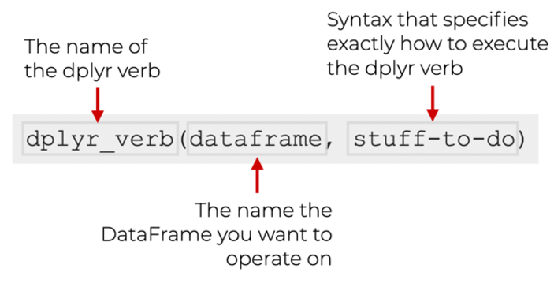
```

--

```{r, echo=FALSE}
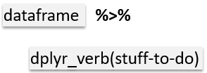
```

---
### Lab session

```{r, echo=FALSE}
include_graphics("images/lab.png")
```

---
class: middle, center, inverse
name: viz

# Data visualization with ggplot2

```{r, echo=FALSE}
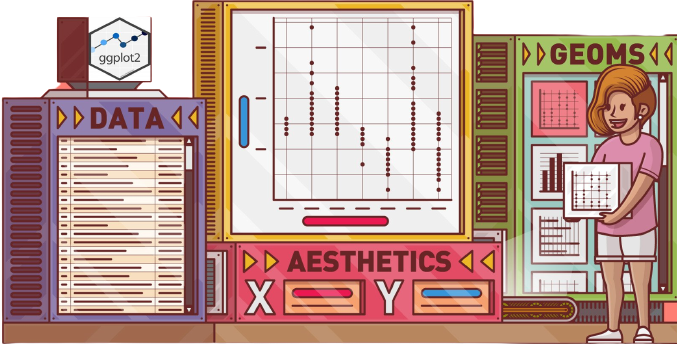
```


---

.pull-left[
  
```{r, echo=FALSE, out.height= "36%", out.width="82%"}
  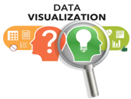
```
]

<br>

<br>

--

.w-100.lh-copy[
Data visualization refers to the graphical representation of data by visual elements such as charts, Infographics, and maps to understand the data. There is a story behind every data, and data visualization brings them to life.
]

--

.w-100.lh-copy[
The importance of Data Visualization is as follows:
]

--

.w-100.lh-copy[
- It is a powerful way to explore data with presentable results
  
- It displays the summary of our data at a glance
  
- Charts make it easier to identify patterns and trends
  
- It helps to identify areas that need attention or improvement.
]

--
.w-100.lh-copy[
It can be hard for the audience to grasp the true meaning of the findings without data visualization.
]

---
class: middle
layout: true

## Data Visualization Techniques

---

.pull-left[

**Name**: Bar chart

**Visual dimensions**:

- length/count

- category

- color

]

.pull-right[

```{r, echo=FALSE, out.height= "100%", out.width="100%"}
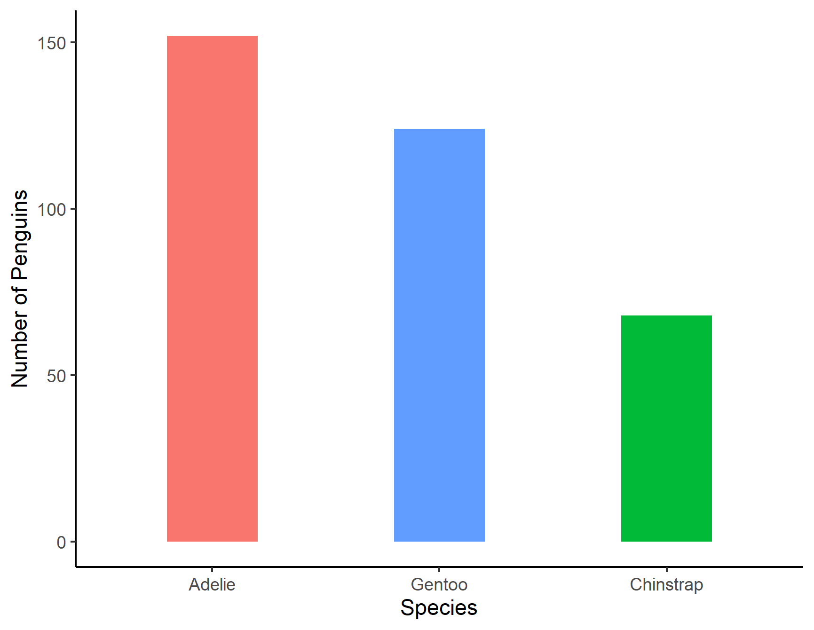
```
]

---

.pull-left[

**Name**: Histogram

**Visual dimensions**:

- bin limits

- count/length

- color

]

.pull-right[

```{r, echo=FALSE, out.height= "100%", out.width="100%"}
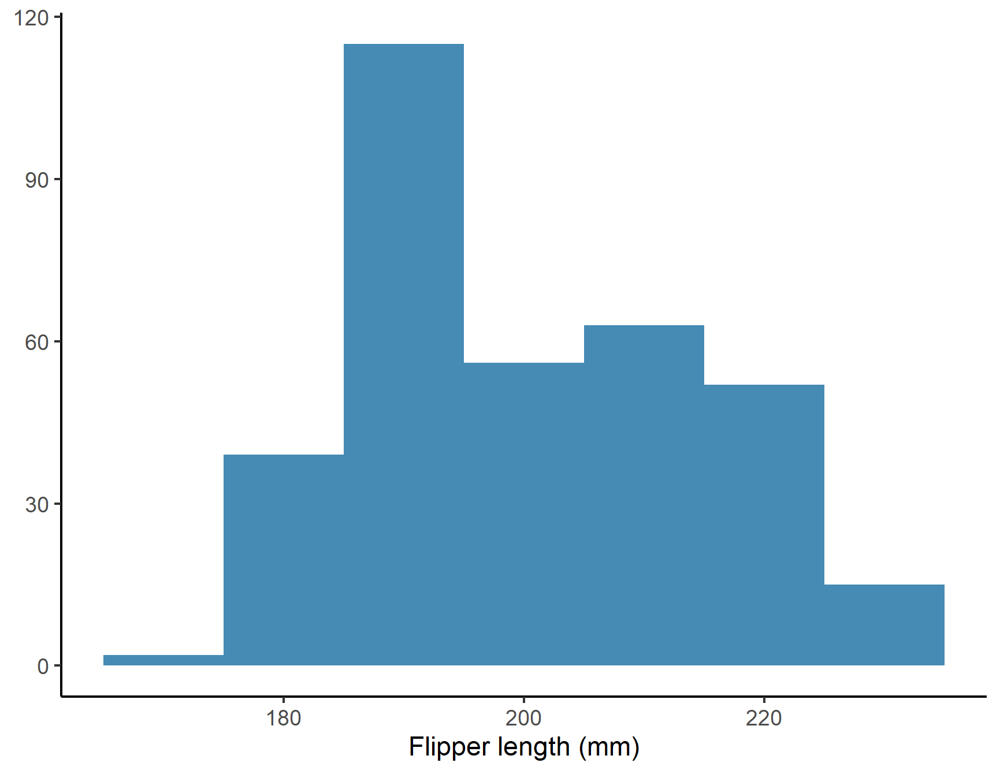
```
]

---

.pull-left[

**Name**: Scatter plot

**Visual dimensions**:

- x position

- y position

- shape

- color

- size


]

.pull-right[

```{r, echo=FALSE, out.height= "100%", out.width="100%"}
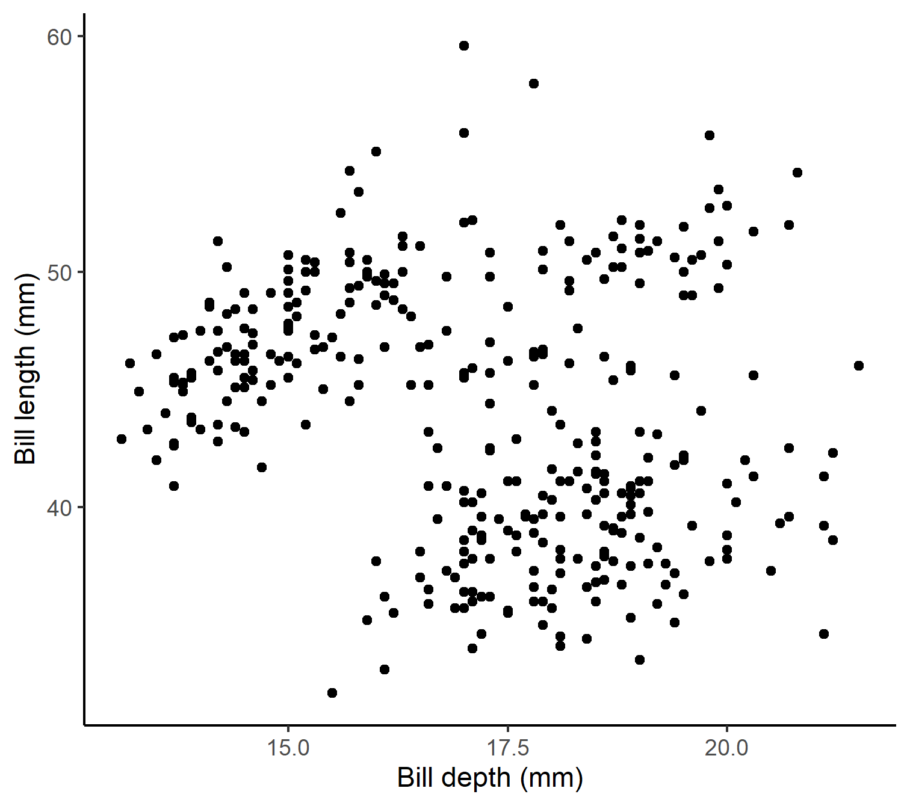
```
]

---
.pull-left[

**Name**: Pie/Doughnut chart	

**Visual dimensions**:

- color


```{r, echo=FALSE, out.height= "100%", out.width="100%"}
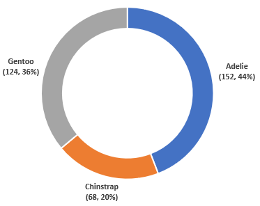
```

]

.pull-right[

```{r, echo=FALSE, out.height= "100%", out.width="100%"}
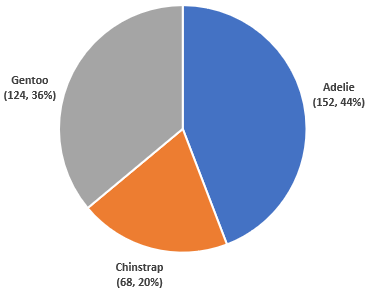
```
]
---
.pull-left[

**Name**: Box and Whisker Plot

**Visual dimensions**:

- x axis

- y axis

]

.pull-right[

```{r, echo=FALSE, out.height= "100%", out.width="100%"}
  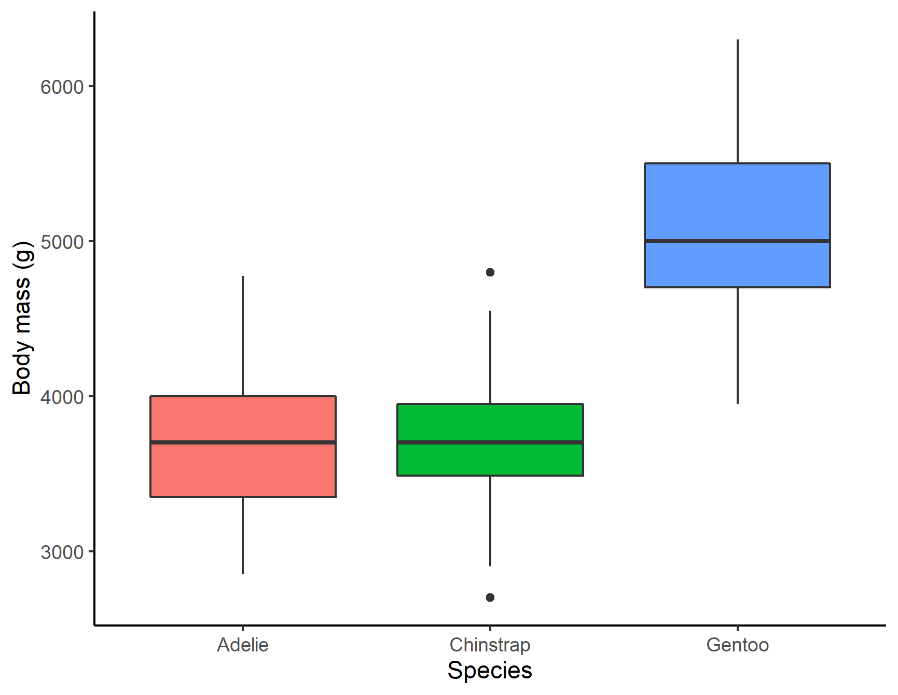
```
]
---
.pull-left[

**Name**: Line chart

**Visual dimensions**:

- x position

- y position

- shape

- color

- size

]

.pull-right[

```{r, echo=FALSE, out.height= "100%", out.width="100%"}
  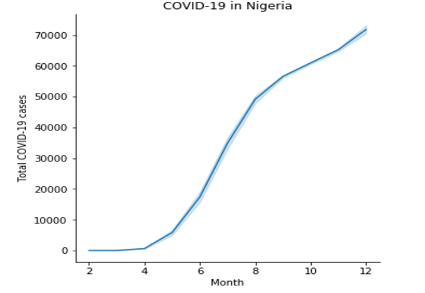
```
]

---

layout: false
class: middle

## Data visualization using ggplot2 


.w-100.lh-copy[
R has several systems for making graphs, but ggplot2 is one of the most elegant and most versatile. `ggplot2` is based on the grammar of graphics, the idea that you can build every graph from the same components: 

- a data set

- a coordinate system also known as aesthetic mapping

- geoms: visual marks that represent data points.

With ggplot2, you can do more faster by learning one system and applying it in many places.
]

---
class: middle

## Data visualization using ggplot2 

.w-100.lh-copy[
Aesthetic mappings describe how variables in the data are mapped to visual properties (aesthetics) of geoms: 
]

.pull-left[
.w-100.lh-copy[

`x`: variable on the x-axis 

`y`: variable on the y-axis

`fill`: fill color for shapes
 
`color`: color points and lines
 
`size`: size of the points
 
`shape`: shape of the points
 
`weight`: frequency weights
]
]

.pull-right[
`ymin`: used in ribbons charts with ymax to display an interval between two lines
 
`ymax`: used in ribbons charts with ymin to display an interval between two lines
 
`facet`: create small multiples
 
`facet row`: create small multiples by rows
 
`facet col`: create small multiples by columns
]

`group`: identifies series of points with a grouping variable

---
### Lab session

```{r, echo=FALSE}
include_graphics("images/lab.png")
```

---
class: center, middle

## Summary

.left[
.w-100.lh-copy[
This tutorial introduced you to pipe operator in `R` programming. 

In this tutorial, you have learnt that:

1. there are many dplyr verbs and they include `select()`, `mutate()`, `filter()`, `group_by()`, and `summarise()`.

2. you can use any visualization technique to plot data with ggplot2 package.

3. you can choose from different layers such as `geom_point()`, `geom_col()`, `geom_histogram()`, `geom_boxplot()`, etc. 

]
]

---
class: center, middle, inverse

# The end

--

**Thank you**